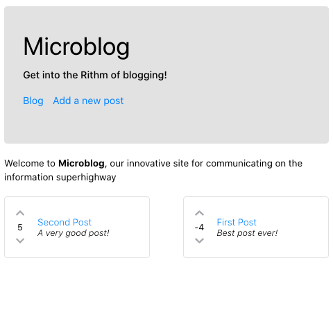

# Microblog

This was the first React application I created using Redux. It is a simple blog post website where users can create posts. Posts can be upvoted/downvoted, and users visiting the website can also leave comments on the posts.

Working Demo [Here](https://microblog-react.netlify.app/)!



## Built With

* [React](https://github.com/facebook/react) - The web framework used
* [Redux](https://github.com/reduxjs/react-redux) - State management tool used to store all posts and comments
* [Axios](https://github.com/axios/axios) - HTTP Client used to communicate with the backend server
* [Immer](https://github.com/immerjs/immer) - Used to manage immutable state in Redux
* [Font-Awesome](https://github.com/FortAwesome/Font-Awesome) - For all the cool icons used in the frontend application!

## Prerequisites
The application is currently divided up into 2 separate GitHub repos. This was done in order for deployment purposes. Specifically, the React frontend is being hosted on Netlify, and the Node Express backend is being hosted on Heroku. You can find the repo to the Express backend [here](https://github.com/mxjung/microblog-backend).


### Installing

Clone the Express backend [repository](https://github.com/mxjung/microblog-backend) and install (follow instructions on respective repository README).

Clone this repository and `cd` into it

```
npm install
```

Start the application session

```
npm start
```

## Deployment

Netlify was used to host the React frontend framework. This was done by connecting this github repo to a Netlify domain. The only tricky part to consider during deployment is the BASE_URL used in the application.

* In actions.js, the default BASE_URL for local Testing Environment is:

  const BASE_URL = "http://localhost:5000/api/posts";

* When in Production Environment, the BASE_URL should be changed to:

  const BASE_URL = "https://microblog-server.herokuapp.com/api/posts";

When working on local machine, please use the localhost domain, whereas during deployment, use the respective backend url (for mine, it was the heroku backend url).


